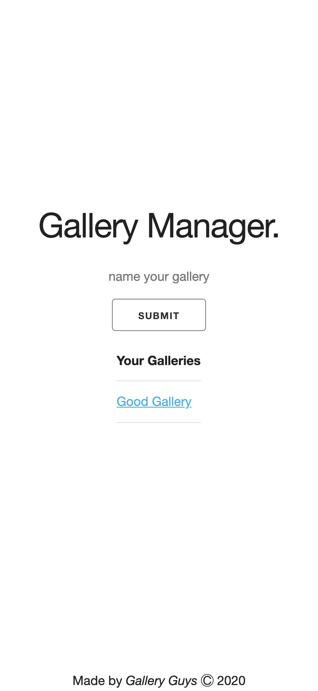
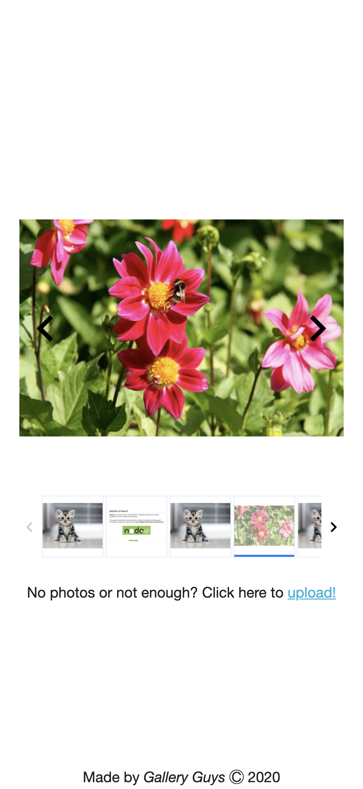

# Project_2

* Brandon, Monty and Scott Project #2 for Vanderbilt Coding Bootcamp

* This app allows the user to create a new photo gallery link of their name choice and then populate the gallery with their own photos via cloudinary API widgets and static HTML pages

## User Story

```
AS A person who has lots of photos

I WANT to store my photos

SO THAT I may view them together in a responsive gallery
```

#### Technology Used

- cloudinary
- express
- express-handlebars
- mysql2
- sequelize
- sequelize CLI

## Before Using This App

1) run the query's of the provided schema and sql files in your MySQL

2) open the config.json file and input your peronal info to connect (i.e. password in development)

3) open your terminal and run `npm i` or `npm install` to install all node packages

4) still in terminal, run `node server.js` or `npm start` to launch the app

5) proceed to "http://localhost:8080" in your browser

## Examples Of Running App






### Heroku Deployment

- [Click here for Heroku Deployment](https://vbc-project-02.herokuapp.com/)